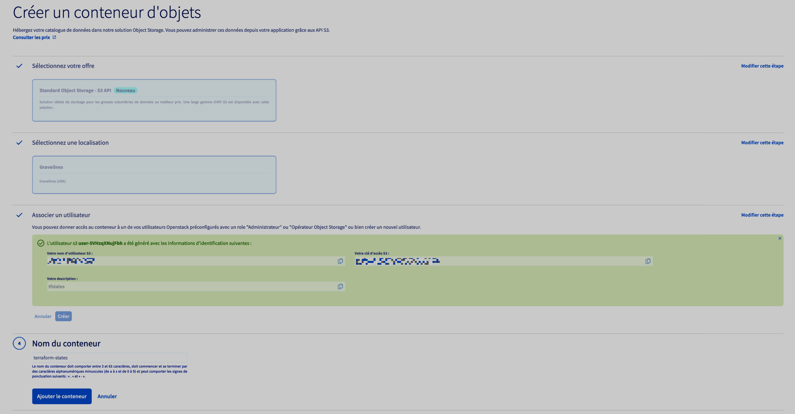

# terraform states OVH

based on <https://docs.ovh.com/gb/en/public-cloud/use_object_storage_terraform_backend_state/>

## Create a object storage container

## add credentials

- Take the credentials of the user created from the OVH control panel
  and insert them into `.env` file
- Reload your shell
